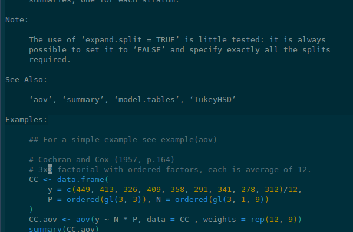
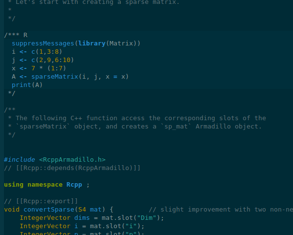
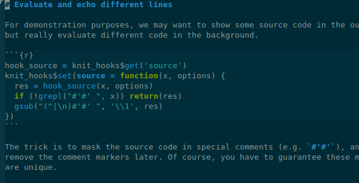

## Overview

Polymode is an emacs package that offers support for multiple major modes inside
a single emacs buffer. It is lightweight and fully object oriented, specifically
designed for quick addition of new polymodes.

Technically speaking, polymode doesn't keep its modes in a single emacs buffer
but in several indirect buffers, actually as many as different modes are there
in a file. Consequently, polymode is as fast as switching buffers because it
never re-installs major modes. I am very much indebted to Dave Love's
[multi-mode.el](http://www.loveshack.ukfsn.org/emacs/multi-mode.el) for this
awesome idea.


## Installation 

The project is in an alpha stage and it is not, as yet, available in melpa
repo. You will have to install it manually:

```sh
git clone https://github.com/vitoshka/polymode.git
```

Add "polymode" directory and "polymode/modes" to your emacs path:

```lisp 
(setq load-path
      (append '("path/to/polymode/"  "path/to/polymode/modes")
              load-path))
```

Require any polymode bundles that you are interested in:

```lisp
(require 'poly-R)
(require 'poly-markdown)
```

Note that for the full use of poly-markdown modes you will need
[markdown-mode.el](http://jblevins.org/projects/markdown-mode/). It is also
available from MELPA repository.


## Polymodes activation

Polymode defines emacs major and minor modes that you can use in full compliance
with emacs usual conventions.

There are two main ways to activate emacs mode. 

   1. _By registering a file extension_. Some of the file extensions are already
defined for you "Rmd", "Snw", "Rcpp", "cppR", "Rhtml" etc. You can find some
examples in `tests` sub-directory. Of course you can always set your own
extensions by adding them to `auto-mode-alist`.

   1. By setting local mode variable in you file. This is how you would activate C++R mode:
   
   ```c++
   // -*- mode: poly-C++R -*-
   ```
   or 
   ```sh
   ## -*- mode: poly-brew+R; -*-
   ```


<!-- ## Naming conventions  -->

<!-- The core polymode object and modes are usually named as "engine+submode", or -->
<!-- "base_mode+submode" like "noweb+R", "markdown+R", "C++R" and "R++C".  -->

<!-- todo: more to come on this ... need to define object hierarchy for the full story. -->


## Warning

   * Tested with Emacs 24.3.1 and unlikely to work with Emacses older
     than 24.2 because of the heavy use of pattern matching and eieio.
   
Some things still don't work as expected. For example:
    
   * To kill a polymode buffer you will have position the cursor in the base mode buffer. 
   * Customization interface is not working as expected (an eieio bug) and is
     not tested. 
   * No literate programming backends (in the sense of weavers, tanglers and
     exporters).
   * Occasional problems with font-lock. Messages like `Error during
     redisplay: (jit-lock-function 163) signaled (args-out-of-range 1
     142)` are posible.
     
     
## Screenshots

### Ess-help buffer



### C++R


### markdown+R




