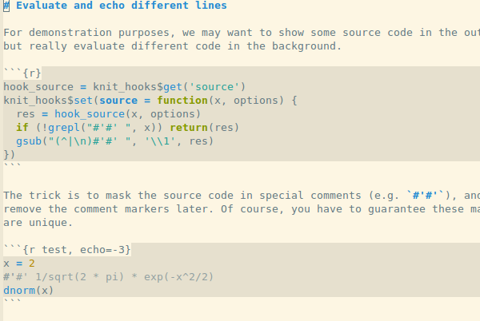

   
  
  
  

  

Polymode is a framework for multiple major modes (MMM) inside a single Emacs
buffer. It is lightweight, object oriented and highly extensible. Creating new
polymodes normally takes a few lines of code. Full documentation at
https://polymode.github.io/.

    

